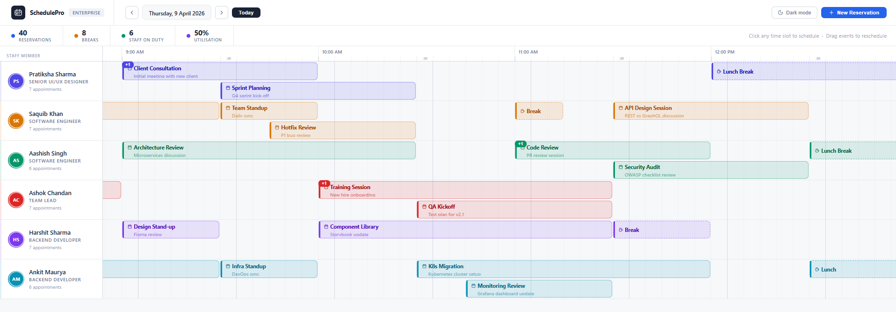

# SchedulePro Calendar

<div align="center">


**A professional, enterprise-grade staff reservation calendar component for React & Next.js.**

Developed & Designed by **Mohammad Saquib Khan**

[📦 npm](https://www.npmjs.com/package/schedulepro-calendar) · [🐛 Issues](https://github.com/YOUR_USERNAME/schedulepro-calendar/issues) · [📖 Changelog](https://github.com/YOUR_USERNAME/schedulepro-calendar/blob/main/CHANGELOG.md)

</div>

---

## Preview



> A 24-hour horizontal timeline calendar with per-staff rows, drag & drop rescheduling, 5-minute precision, overlap stacking, and a polished corporate design in both light and dark themes — built for hospitality, healthcare, and enterprise scheduling workflows.

---

## Features

- 🗓 **24-hour timeline** — full day view with 5-minute cell precision
- 👥 **Per-staff rows** — each staff member gets their own horizontal lane with name, role, and avatar
- 🖱 **Drag & drop** — move reservations across time slots and between staff members
- ↔ **Resize handle** — drag the right edge of any card to extend in 5-min steps
- 🔁 **Overlap stacking** — up to 2 events shown side-by-side; extras shown as a `+N` badge with a popup
- ➕ **Add via click** — click any time cell to open a context menu → reservation or break
- ☕ **Break support** — breaks render with a dashed border and coffee icon
- 🌙 **Dark & light themes** — full theme support via CSS variables
- 🇯🇵 **Japanese holiday detection** — built-in support for Japanese national holidays
- 📱 **Responsive** — adapts cleanly to different container widths
- ⌨ **TypeScript** — fully typed props and event handlers

---

## Installation

```bash
npm install schedulepro-calendar
```

```bash
yarn add schedulepro-calendar
```

```bash
pnpm add schedulepro-calendar
```

---

## Quick Start

```tsx
import { ScheduleCalendar } from 'schedulepro-calendar';
import 'schedulepro-calendar/dist/styles.css';

const staff = [
  { id: '1', name: 'Aiko K.', role: 'Receptionist', avatar: 'AK' },
  { id: '2', name: 'Taro M.', role: 'Concierge',    avatar: 'TM' },
  { id: '3', name: 'Sara K.', role: 'Housekeeping', avatar: 'SK' },
];

const reservations = [
  {
    id: 'r1',
    staffId: '1',
    title: 'Room 201 — Yamada',
    startTime: '2024-04-10T08:10:00',
    endTime:   '2024-04-10T09:30:00',
    type: 'reservation',
  },
  {
    id: 'r2',
    staffId: '1',
    title: 'Break',
    startTime: '2024-04-10T13:10:00',
    endTime:   '2024-04-10T13:40:00',
    type: 'break',
  },
];

export default function SchedulePage() {
  return (
    <ScheduleCalendar
      staff={staff}
      reservations={reservations}
      date="2024-04-10"
      theme="dark"
      onReservationMove={(id, newStaffId, newStart, newEnd) => {
        console.log('Moved:', id, newStaffId, newStart, newEnd);
      }}
      onReservationResize={(id, newEnd) => {
        console.log('Resized:', id, newEnd);
      }}
      onCellClick={(staffId, time) => {
        console.log('Cell clicked:', staffId, time);
      }}
    />
  );
}
```

---

## Props

### `<ScheduleCalendar />`

| Prop | Type | Default | Description |
|------|------|---------|-------------|
| `staff` | `StaffMember[]` | required | Array of staff members to display as rows |
| `reservations` | `Reservation[]` | required | Array of reservation/break events |
| `date` | `string` | today | ISO date string for the displayed day (`YYYY-MM-DD`) |
| `theme` | `'light' \| 'dark'` | `'light'` | Color theme |
| `startHour` | `number` | `0` | Start hour for the timeline (0–23) |
| `endHour` | `number` | `24` | End hour for the timeline (1–24) |
| `cellMinutes` | `number` | `5` | Minimum time cell precision in minutes |
| `onReservationMove` | `function` | — | Fired when a card is drag-dropped to a new position |
| `onReservationResize` | `function` | — | Fired when a card's end time is resized |
| `onCellClick` | `function` | — | Fired when an empty time cell is clicked |
| `onReservationClick` | `function` | — | Fired when a reservation card is clicked |
| `className` | `string` | — | Additional CSS class on the root element |

---

### `StaffMember`

```ts
interface StaffMember {
  id: string;
  name: string;
  role?: string;
  avatar?: string;   // initials or image URL
  color?: string;    // accent color for the avatar circle
}
```

### `Reservation`

```ts
interface Reservation {
  id: string;
  staffId: string;
  title: string;
  startTime: string;    // ISO datetime string
  endTime: string;      // ISO datetime string
  type?: 'reservation' | 'break';
  color?: string;       // override card accent color
  note?: string;        // optional tooltip/description
}
```

---

## Theming

Import the base stylesheet and optionally override CSS variables:

```css
/* Override theme tokens */
:root {
  --sp-bg-primary:     #0f1117;
  --sp-bg-row:         #13161f;
  --sp-bg-header:      #181c25;
  --sp-accent-blue:    #3b82f6;
  --sp-accent-green:   #22c55e;
  --sp-accent-purple:  #a855f7;
  --sp-text-primary:   #e2e8f0;
  --sp-text-muted:     #64748b;
  --sp-border:         #1e2330;
  --sp-cell-width:     96px;   /* width per hour */
  --sp-row-height:     72px;
}
```

---

## Next.js Setup

Since this package uses `'use client'` directives, import it inside a Client Component:

```tsx
// app/schedule/page.tsx
'use client';
import { ScheduleCalendar } from 'schedulepro-calendar';
import 'schedulepro-calendar/dist/styles.css';
```

Or wrap it in a dynamic import to skip SSR:

```tsx
import dynamic from 'next/dynamic';

const ScheduleCalendar = dynamic(
  () => import('schedulepro-calendar').then(m => m.ScheduleCalendar),
  { ssr: false }
);
```

---

## Keyboard & Accessibility

| Key | Action |
|-----|--------|
| `Tab` | Move focus between reservation cards |
| `Enter` / `Space` | Select / open a reservation card |
| `Arrow keys` | Move focused card by 5 minutes |
| `Escape` | Close context menu or modal |

---

## Browser Support

| Browser | Version |
|---------|---------|
| Chrome | 90+ |
| Firefox | 88+ |
| Safari | 14+ |
| Edge | 90+ |

---

## Peer Dependencies

```json
{
  "react": ">=18.0.0",
  "react-dom": ">=18.0.0",
  "next": ">=13.0.0"
}
```

---

## Roadmap

- [ ] Week view
- [ ] Month view
- [ ] Resource grouping (rooms, floors)
- [ ] Recurring reservations
- [ ] Export to iCal / CSV
- [ ] Touch / mobile drag support

---

## Contributing

Pull requests are welcome! Please open an issue first to discuss what you'd like to change.

```bash
git clone https://github.com/YOUR_USERNAME/schedulepro-calendar.git
cd schedulepro-calendar
npm install
npm run dev
```

---

## License

MIT © [Mohammad Saquib Khan](https://github.com/YOUR_USERNAME)

---

<div align="center">
  <sub>Built with ❤️ by Mohammad Saquib Khan · <a href="https://www.npmjs.com/package/schedulepro-calendar">npmjs.com/package/schedulepro-calendar</a></sub>
</div>
